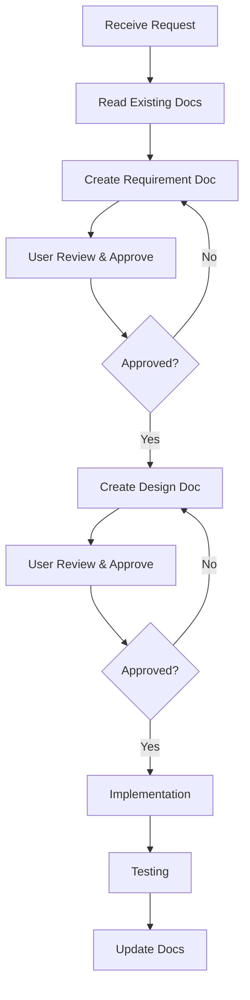

# AI Development Workflow Rules

## 📋 Mandatory Process

When receiving any feature request or bug fix:

1. **Read Existing Documentation** (MANDATORY)
   - Check `docs/requirements/` for related feature specs
   - Review `docs/design/` for technical design docs
   - Consult `docs/standards/` for coding and testing standards

2. **Documentation First** (MANDATORY)
   - For new features: Create requirement doc in `docs/requirements/YYYYMMDD-feature-name.md`
   - For technical changes: Create design doc in `docs/design/YYYYMMDD-feature-name-technical-design.md`
   - Get user approval before coding

3. **Implementation**
   - Follow project standards in `docs/standards/`
   - Reference requirement and design docs during development
   - Update docs if implementation differs from design

4. **Testing & Validation**
   - Follow testing standards from `docs/standards/testing-standards.md`
   - Document test results in design doc

## 📁 Documentation Structure

```
docs/
├── requirements/           # Feature requirements (PRD)
│   └── YYYYMMDD-feature-name.md
├── design/                # Technical design docs
│   └── YYYYMMDD-feature-name-technical-design.md
├── standards/             # Project standards & templates
│   ├── requirements-template.md
│   ├── technical-design-template.md
│   ├── coding-standards.md
│   └── testing-standards.md
└── analysis/              # Project analysis
    └── project-analysis.md
```

## 🎯 Document Naming Convention

- **Requirement**: `docs/requirements/YYYYMMDD-feature-name.md`
  - Example: `20260325-batch-registration.md`

- **Design**: `docs/design/YYYYMMDD-feature-name-technical-design.md`
  - Example: `20260325-batch-registration-technical-design.md`

- **Same-day conflicts**: Append `-v2`, `-v3`
  - Example: `20260325-ui-optimization-v2.md`

## 🔄 Workflow for New Features



## 📝 Documentation Standards

### Requirement Document (PRD)
- **Location**: `docs/requirements/`
- **Template**: `docs/standards/requirements-template.md`
- **Content**: User stories, acceptance criteria, non-functional requirements

### Technical Design Document
- **Location**: `docs/design/`
- **Template**: `docs/standards/technical-design-template.md`
- **Content**: Architecture, API design, data models, technical decisions

### Coding Standards
- **Location**: `docs/standards/coding-standards.md`
- **Content**: TypeScript conventions, Electron patterns, file organization

### Testing Standards
- **Location**: `docs/standards/testing-standards.md`
- **Content**: Test coverage requirements, testing strategies, CI/CD

## 🚫 What NOT to Do

- ❌ Start coding without reading existing docs
- ❌ Skip requirement/design documentation
- ❌ Make technical decisions without documentation
- ❌ Ignore project coding standards
- ❌ Proceed without user approval on docs

## ✅ What TO Do

- ✅ Always check for existing documentation first
- ✅ Create requirement doc for new features
- ✅ Create design doc for technical changes
- ✅ Follow project standards consistently
- ✅ Update docs when implementation differs
- ✅ Get user approval before major work

## 🔍 Quick Reference

| Task Type | Required Docs | Location |
|-----------|---------------|----------|
| New Feature | Requirement + Design | `docs/requirements/` + `docs/design/` |
| Bug Fix (Complex) | Design Doc | `docs/design/` |
| Bug Fix (Simple) | Code Comments | In source code |
| Architecture Change | Design Doc | `docs/design/` |
| Code Refactor | Design Doc (if major) | `docs/design/` |

## 📚 Key Project Information

- **Tech Stack**: Electron + TypeScript + Playwright + React
- **Main Purpose**: Automated AWS Kiro account registration
- **Key Services**: Tempmail.lol integration, Browser automation
- **Export Format**: claude-api compatible JSON

See `docs/analysis/project-analysis.md` for detailed project structure and patterns.

---

**Remember**: Documentation drives development. Always document first, code second.
